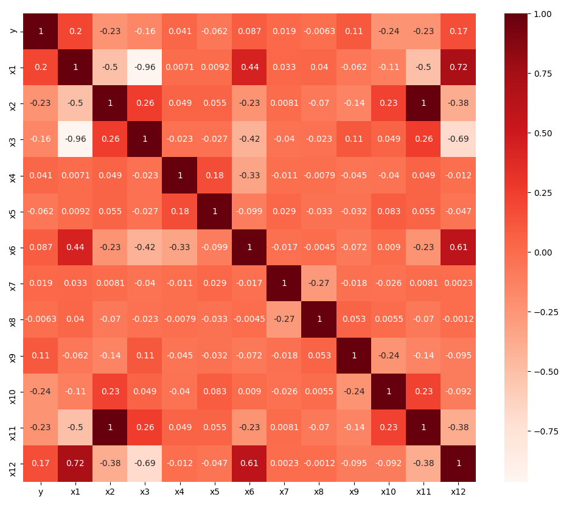

# The challenge
The challenge of the assignment was to find a suitable classifier and modify the data as needed.
I chose to use the XGBoost classifier after trying out several other classifiers since it gave 
the best cross-validation result both with and without sampling.
Since there was little correlation between the features and the labels, and the samples across all
classes were unevenly distributed, I chose to use downsampling. 

## The data
### Statistics of the data
```
                 x1          x2          x3          x4          x5          x7          x8          x9         x10         x11
count  9.950000e+02  995.000000  995.000000  995.000000  995.000000  995.000000  995.000000  995.000000  995.000000  995.000000
mean   3.870680e+09  -15.435224    0.177062    9.489500   -0.054872   -0.178905   -0.264852  -76.776080    7.867880  -20.065791
std    1.273066e+11    0.058288    0.422576   10.184405    4.951394   10.411742   21.009144    2.091847    1.475560    0.075774
min   -1.609935e+11  -15.616070   -0.838280  -22.509710  -17.947490  -33.185590  -88.579430  -82.833770    3.469400  -20.300880
25%   -2.792536e+01  -15.475350   -0.089675    2.391805   -3.339180   -6.794980  -13.089790  -78.278975    6.919830  -20.117955
50%   -1.378519e+01  -15.430820    0.141180    9.579880   -0.236130    0.029320    0.571090  -77.112120    7.864820  -20.060060
75%   -2.092515e+00  -15.388350    0.547550   16.705615    3.437260    6.242145   12.957455  -75.396750    8.812955  -20.004855
max    4.012320e+12  -15.326580    0.872200   38.459990   13.799790   32.285820   97.420100  -70.344290   12.521470  -19.924560
```
### Samples from the data

```
         y        x1        x2       x3        x4        x5                   x6        x7        x8        x9       x10       x11    x12
0  Shoogee   1.62243 -15.51242 -0.11115  16.86347  -3.55037  GMMs and Accordions   0.21564  51.35588 -74.79739   4.41501 -20.16615   True
1   Atsuto -33.80391 -15.44170  0.78171  28.11765   6.41342   Bayesian Inference  18.70829  12.72187 -78.84386   6.42020 -20.07421  False
2      Bob -10.49048 -15.48716  0.19168  16.87734  11.41567   Bayesian Inference  -8.57972   6.02294 -78.18658  10.44804 -20.13331  False
3   Atsuto -18.39930 -15.47262  0.39385   0.32310  -1.22566   Bayesian Inference   8.81810  -8.26627 -78.24734   8.27237 -20.11441  False
4     Jorg -38.06452 -15.37007  0.74519   3.12356   0.15829   Bayesian Inference  -2.90392 -11.76543 -79.92011   7.23429 -19.98109  False
5   Atsuto   2.13528 -15.47278 -0.21677  11.62632  -1.78539  GMMs and Accordions   5.60305 -23.30847 -75.35696   8.98161 -20.11462   True
6      Bob -12.06341 -15.39016  0.01734   1.92766  -2.52138   Bayesian Inference -14.80564  21.27088 -78.26144   8.06903 -20.00721  False
7   Atsuto  -1.00275 -15.45690 -0.15962   3.50596   2.04260   Bayesian Inference   1.78448 -16.20681 -76.73808   7.70020 -20.09396  False
8     Jorg -12.88126 -15.44137  0.15842   7.79609   0.34916   Bayesian Inference  -1.90421  18.03565 -77.61847   5.77048 -20.07378  False
9     Jorg   0.14535 -15.43310 -0.24804  12.47875  -4.24306  GMMs and Accordions  -4.48597 -27.31991 -73.56616   5.75394 -20.06303   True
```
### Covariance matrix


## Results
Classification report on the XGBoost classifier evaluated on the test set
```
              precision    recall  f1-score   support

           0       0.81      0.52      0.63        91
           1       0.57      0.80      0.67        51
           2       0.51      0.85      0.64        26
           3       1.00      0.81      0.89        26

    accuracy                           0.68       194
   macro avg       0.72      0.74      0.71       194
weighted avg       0.73      0.68      0.68       194
```